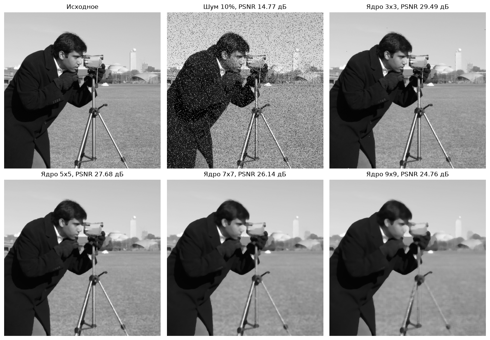
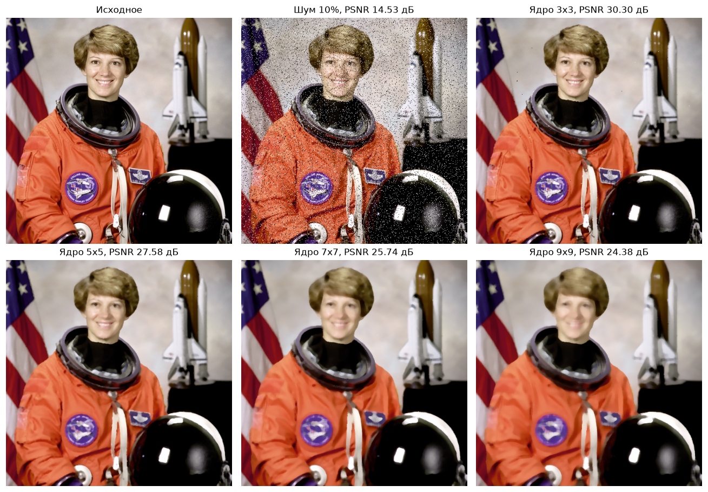
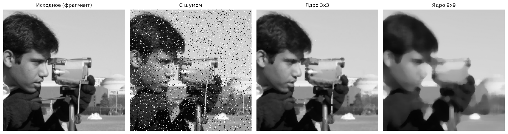
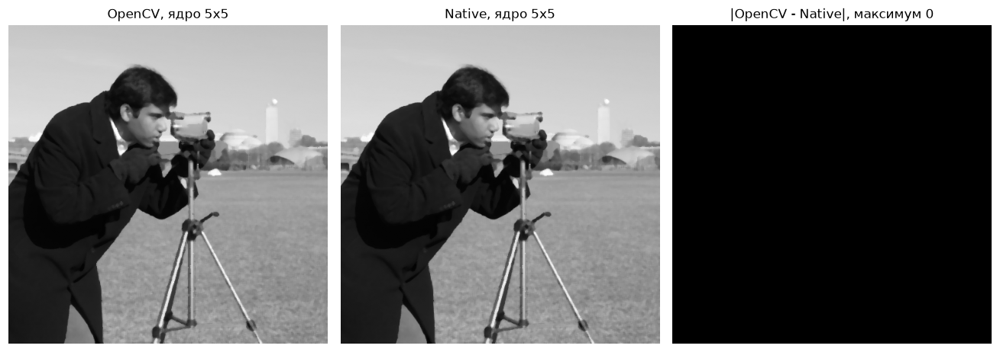
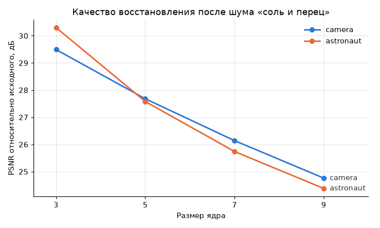
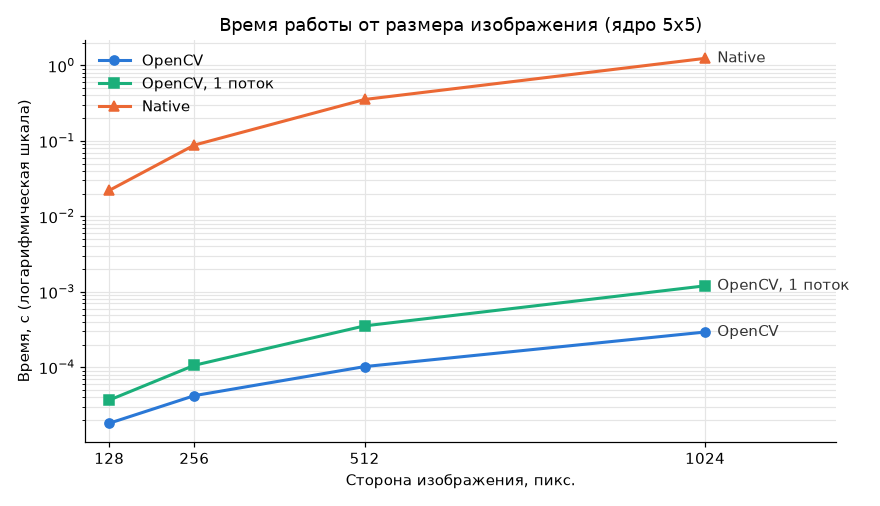
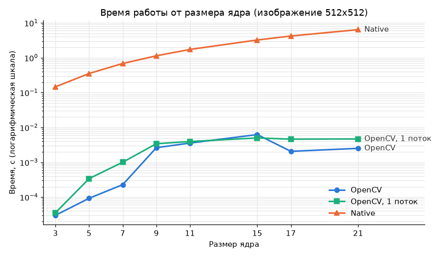

# Медианный фильтр с переменным размером ядра

Лабораторная работа 1 по дисциплине «Системы компьютерной обработки изображений».
Вариант 4: медианный фильтр с переменным размером ядра.

Выполнил: Молодиченко Семен Андреевич, группа P3313.

Медианный фильтр реализован в двух вариантах:

- **OpenCV**: встроенная функция `cv2.medianBlur`;
- **Native**: собственная реализация на чистом Python. Сам алгоритм (сбор окна и сортировка) написан на списках Python, без NumPy и OpenCV.

Обе реализации дают одинаковый результат пиксель в пиксель. Их скорость сравнивается на изображениях разного размера и с разными ядрами.

## 1. Теоретическая база

### Медианный фильтр

Медианный фильтр относится к нелинейным ранговым (порядковым) фильтрам. Окно размером k×k (k нечётное) по очереди ставится центром на каждый пиксель. Значения яркости в окне сортируются, и центральный пиксель получает значение медианы, то есть элемента, стоящего посередине отсортированного списка:

```
g(x, y) = med { f(x + i, y + j) : i, j = -r..r },   r = (k - 1) / 2
```

В окне k² значений. Медиана стоит в отсортированном списке под индексом (k² − 1) / 2, если считать с нуля: для 3×3 это индекс 4 (пятый элемент из 9), для 5×5 индекс 12 (тринадцатый из 25). Ядро берётся нечётным, чтобы у окна был центральный пиксель, а число элементов было нечётным и медиана определялась однозначно.

Цветное изображение обрабатывается по каналам независимо: каждый канал B, G, R фильтруется как отдельное полутоновое изображение.

### Почему медиана хорошо убирает импульсный шум

Импульсный шум «соль и перец» заменяет случайные пиксели на чисто белые (255) или чисто чёрные (0). После сортировки окна такие выбросы оказываются по краям списка, а медиана берётся из середины, поэтому одиночные выбросы на результат не влияют. Усредняющие фильтры (box, Гаусс) так не умеют: они размазывают выброс по соседям, и вместо точки получается серое пятно.

Ещё одно свойство: медианный фильтр сохраняет резкие перепады яркости (границы объектов) лучше линейного сглаживания, потому что не создаёт новых значений между двумя уровнями яркости. Зато он полностью удаляет светлые и тёмные детали, площадь которых меньше половины окна (меньше k²/2 пикселей) [1]. Поэтому с ростом ядра пропадают тонкие линии и мелкие детали, а изображение становится «плоским».

### Обработка границ

У пикселей на краю изображения часть окна выходит за его пределы. В работе изображение дополняется повторением крайних пикселей (`BORDER_REPLICATE`): `aaa|abcd|ddd`. Так же поступает `cv2.medianBlur` [4], поэтому результаты обеих реализаций совпадают и на границах.

### Вычислительная сложность

| Способ | Сложность на один пиксель | Где применяется |
|---|---|---|
| Сортировка окна | O(k² log k²) | наивный алгоритм, реализация Native |
| Сортирующие сети | фиксированное число сравнений | малые ядра 3×3, 5×5, 7×7 |
| Скользящая гистограмма Хуанга | O(k) | средние ядра [2] |
| Гистограммы столбцов Перро–Эбера | O(1), не зависит от k | большие ядра [3] |

Наивный алгоритм на каждом пикселе заново собирает и сортирует k² значений. Быстрые алгоритмы пользуются тем, что при сдвиге окна на один пиксель меняется только один столбец. Для 8-битных изображений яркость принимает 256 значений, поэтому вместо сортировки можно хранить гистограмму окна и обновлять её при сдвиге [2]. В алгоритме Перро–Эбера гистограмма окна собирается из заранее посчитанных гистограмм столбцов, и время на пиксель вообще не зависит от размера ядра [3].

### Оценка качества: PSNR

Чтобы сравнить результат с исходным изображением без шума, используется пиковое отношение сигнал/шум:

```
MSE  = (1 / N) · Σ (I(p) − K(p))²
PSNR = 10 · log10(255² / MSE)   [дБ]
```

Чем выше PSNR, тем ближе результат к оригиналу.

## 2. Описание разработанной системы

### Структура проекта

```
lab1/
|-- median_filter.py     # обе реализации фильтра: median_opencv и median_native
|-- main.py              # CLI: применить фильтр к одному изображению
|-- prepare_images.py    # загрузка тестовых изображений и наложение шума
|-- demo.py              # результаты для разных ядер, сравнение реализаций, PSNR
|-- benchmark.py         # замеры времени, таблица и графики
|-- test_median.py       # тесты pytest
|-- requirements.txt
|-- images/              # исходные и зашумлённые изображения
`-- results/             # результаты, графики, CSV с замерами
```

### Архитектура

```
                 prepare_images.py
                 (skimage.data + шум "соль и перец")
                          |
                          v
                     images/*.png
                          |
        +-----------------+------------------+
        |                 |                  |
        v                 v                  v
     main.py           demo.py          benchmark.py
     (CLI)          (картинки, PSNR)   (время, графики)
        |                 |                  |
        +-----------------+------------------+
                          |
                          v
                   median_filter.py
               +----------+-----------+
               |                      |
               v                      v
         median_opencv          median_native
       (cv2.medianBlur)        (чистый Python)
```

Все скрипты работают через один модуль `median_filter.py`. Чтение и запись файлов (`cv2.imread`, `cv2.imwrite`) общие для обеих реализаций, различается только сам алгоритм фильтрации.

### Реализация через OpenCV

```python
def median_opencv(image, ksize):
    check_ksize(ksize)
    return cv2.medianBlur(image, ksize)
```

`cv2.medianBlur` принимает квадратное ядро нечётного размера, обрабатывает каналы независимо и дополняет границы по правилу `BORDER_REPLICATE` [4]. Какой алгоритм выполняется внутри, зависит от платформы:

- **x86.** Работает собственный код OpenCV [5]:
    - сортирующие сети для ядер 3 и 5 (`medianBlur_SortNet`);
    - для 8-битных изображений и ядер от 7 гистограммный алгоритм со сложностью O(k) (`medianBlur_8u_Om`) или алгоритм Перро–Эбера O(1) (`medianBlur_8u_O1`). Порог между ними задаётся в функции `medianBlur` и зависит от размера изображения: для изображений меньше 1 Мпикс со SIMD O(k) используется для ядер до 15 включительно.
- **ARM.** В сборке `opencv-python` для ARM (Apple M1, на котором делались замеры) подключён HAL KleidiCV от Arm. Это видно в `cv2.getBuildInformation()`, где перечислены `kleidicv_hal` и `kleidicv_thread`. KleidiCV перехватывает `medianBlur` и выбирает алгоритм по размеру ядра [6]:

| Ядро | Алгоритм KleidiCV |
|---|---|
| 3, 5, 7 | сортирующая сеть (NEON) |
| 9 – 15 | малая гистограмма |
| 17 и больше | большая гистограмма |

### Нативная реализация

```python
def median_native(image, ksize):
    check_ksize(ksize)
    if image.ndim == 3:
        channels = [median_native(image[:, :, c], ksize) for c in range(image.shape[2])]
        return np.dstack(channels)

    r = ksize // 2
    mid = ksize * ksize // 2
    rows = image.tolist()
    height = len(rows)

    # дополняем каждую строку слева и справа на r пикселей
    padded = [[row[0]] * r + row + [row[-1]] * r for row in rows]
    width = len(rows[0])

    result = []
    for y in range(height):
        # строки окна; за верхней и нижней границей берём крайние строки
        window_rows = [padded[min(max(y + dy, 0), height - 1)] for dy in range(-r, r + 1)]
        out_row = []
        for x in range(width):
            window = []
            for row in window_rows:
                window.extend(row[x:x + ksize])
            window.sort()
            out_row.append(window[mid])
        result.append(out_row)

    return np.array(result, dtype=image.dtype)
```

Алгоритм по шагам:

1. Проверить, что ядро нечётное и не меньше 3.
2. Если изображение цветное, обработать каждый канал отдельно и собрать каналы обратно.
3. Перевести изображение в обычные списки Python (`tolist()`), дальше работать только с ними.
4. Дополнить каждую строку на r пикселей слева и справа копиями крайних пикселей.
5. Для каждой строки y взять k строк окна. Если окно выходит за верх или низ изображения, номер строки ограничивается диапазоном `[0, height − 1]`, то есть берётся крайняя строка (`BORDER_REPLICATE`).
6. Для каждого пикселя x собрать окно из k срезов длины k, отсортировать его и взять элемент с индексом k² // 2.
7. Собрать результат в массив того же типа, что и вход.

NumPy используется только для того, чтобы принять изображение от `cv2.imread` и вернуть результат в `cv2.imwrite`. Сам фильтр написан на списках и циклах Python.

### Тестовые изображения

Взяты стандартные изображения из `skimage.data` [7]: полутоновое `camera` (512×512) и цветное `astronaut` (512×512). На каждое скрипт `prepare_images.py` накладывает шум «соль и перец»: 10% пикселей заменяются на 0 или 255. Генератор случайных чисел зафиксирован (`seed = 42`), поэтому изображения воспроизводятся.

### Запуск

```bash
python3 -m venv .venv
source .venv/bin/activate
pip install -r requirements.txt

python3 main.py images/camera_noisy.png out.png --ksize 5 --method native
python3 main.py images/astronaut_noisy.png out.png -k 7 -m opencv
```

Параметры `main.py`:

| Параметр | Значение |
|---|---|
| `input`, `output` | пути к исходному изображению и к результату |
| `-k`, `--ksize` | размер ядра, нечётное число не меньше 3 (по умолчанию 3) |
| `-m`, `--method` | `opencv` или `native` (по умолчанию `opencv`) |
| `--gray` | перевести изображение в оттенки серого перед обработкой |

Остальные скрипты:

```bash
python3 prepare_images.py   # тестовые изображения и их версии с шумом
python3 demo.py             # результаты фильтрации, сравнение реализаций, PSNR
python3 benchmark.py        # замеры времени и графики
pytest -v                   # проверка совпадения реализаций
```

## 3. Результаты работы и тестирования

### Результаты фильтрации

Полутоновое изображение, ядра 3, 5, 7, 9:



Цветное изображение, ядра 3, 5, 7, 9:



Увеличенный фрагмент: ядро 3×3 убирает почти весь шум и сохраняет детали, а ядро 9×9 стирает мелкие детали (ремешок камеры, черты лица, здания на фоне):



### Сравнение реализаций

Результаты OpenCV и Native для ядра 5×5 и модуль их разности. Разность равна нулю во всех пикселях:



Совпадение проверяется автотестами `test_median.py` (18 тестов, все проходят):

- случайные полутоновые (17×23) и цветные (40×31×3) изображения, ядра 3, 5, 7, 9, 11, 15: результаты Native и OpenCV совпадают побитово (`np.array_equal`);
- одиночные белый и чёрный выбросы на однородном фоне полностью убираются ядром 3×3;
- для ядер 1, 2, 4, 0, −3 обе функции выбрасывают `ValueError`.

```
$ pytest -q
..................                                                       [100%]
18 passed in 0.29s
```

`demo.py` дополнительно сравнивает реализации на обоих тестовых изображениях для всех ядер: максимальная разница везде 0.

### Качество восстановления (PSNR)

| Изображение | С шумом | Ядро 3 | Ядро 5 | Ядро 7 | Ядро 9 |
|---|---|---|---|---|---|
| camera | 14.77 дБ | **29.49 дБ** | 27.68 дБ | 26.14 дБ | 24.76 дБ |
| astronaut | 14.53 дБ | **30.30 дБ** | 27.58 дБ | 25.74 дБ | 24.38 дБ |



### Быстродействие

Условия замеров: Apple M1, 16 ГБ, macOS 15.7, Python 3.14.5, NumPy 2.5.3, OpenCV 5.0.0 (`opencv-python-headless`). Входное изображение `camera_noisy` масштабируется до нужного размера методом ближайшего соседа, чтобы шум остался импульсным. Для OpenCV берётся лучшее время из 20 запусков, для Native лучшее из 3. OpenCV замерялся дважды: с потоками по умолчанию (8) и с одним потоком (`cv2.setNumThreads(1)`), потому что Native работает в одном потоке. Столбец «Native / OpenCV» считается относительно OpenCV с потоками по умолчанию.

**Опыт 1.** Ядро 5×5, меняется размер изображения:

| Размер | OpenCV | OpenCV, 1 поток | Native | Native / OpenCV |
|---|---|---|---|---|
| 128×128 | 0.018 мс | 0.037 мс | 0.022 с | ×1221 |
| 256×256 | 0.042 мс | 0.106 мс | 0.088 с | ×2097 |
| 512×512 | 0.102 мс | 0.353 мс | 0.354 с | ×3474 |
| 1024×1024 | 0.293 мс | 1.200 мс | 1.243 с | ×4245 |



**Опыт 2.** Изображение 512×512, меняется размер ядра:

| Ядро | OpenCV | OpenCV, 1 поток | Native | Native / OpenCV |
|---|---|---|---|---|
| 3×3 | 0.030 мс | 0.036 мс | 0.147 с | ×4861 |
| 5×5 | 0.093 мс | 0.341 мс | 0.354 с | ×3817 |
| 7×7 | 0.229 мс | 1.007 мс | 0.686 с | ×3001 |
| 9×9 | 2.628 мс | 3.422 мс | 1.140 с | ×434 |
| 11×11 | 3.571 мс | 3.947 мс | 1.737 с | ×486 |
| 15×15 | 6.249 мс | 5.004 мс | 3.243 с | ×519 |
| 17×17 | 2.064 мс | 4.621 мс | 4.216 с | ×2042 |
| 21×21 | 2.517 мс | 4.684 мс | 6.417 с | ×2550 |



Случай 512×512 с ядром 5×5 есть в обоих опытах, и время OpenCV в них отличается примерно на 10% (0.102 и 0.093 мс). Это обычный разброс между запусками, на выводы он не влияет.

Все цифры лежат в [`results/benchmark.csv`](results/benchmark.csv), лог запуска в [`results/benchmark_log.txt`](results/benchmark_log.txt).

### Закономерности

1. **Обе реализации дают одинаковый результат.** Разница 0 на всех тестовых изображениях и ядрах, включая границы. Значит, нативная реализация правильно повторяет и сам алгоритм, и обработку краёв `BORDER_REPLICATE`.
2. **Лучшее качество даёт ядро 3×3.** При 10% шума PSNR вырастает примерно с 14.6 до 29.5–30.3 дБ. С каждым следующим ядром PSNR падает на 1.4–2.7 дБ: шум уже убран, и фильтр начинает стирать полезные детали. При ядре 3×3 остаются отдельные точки шума: это места, где в окне из 9 пикселей оказалось 5 и больше выбросов одного цвета.
3. **Время Native растёт почти линейно с числом пикселей.** От 128×128 до 1024×1024 пикселей в 64 раза больше, а время выросло примерно в 56 раз (0.022 → 1.243 с).
4. **Время Native растёт примерно как k².** От ядра 3 до 21 размер окна вырос в 49 раз (9 → 441), время в 44 раза (0.147 → 6.417 с). На каждом пикселе собирается и сортируется (`list.sort` [8]) окно из k² элементов, поэтому время определяется размером окна.
5. **OpenCV с потоками по умолчанию быстрее Native в 430–4900 раз.** Даже на одном потоке OpenCV быстрее в 330–4100 раз. Сюда входят сразу три фактора: скомпилированный код против интерпретатора, SIMD-инструкции (NEON) и более эффективные алгоритмы.
6. **У OpenCV на ARM три режима, и они видны на графике.** На ядрах 3–7 время составляет доли миллисекунды. Между ядрами 7 и 9 время скачком растёт в 11 раз, а дальше до 15 растёт вместе с ядром. Между 15 и 17 время падает в 3 раза (6.25 → 2.06 мс), и на ядре 21 почти не меняется. Эти границы совпадают с порогами KleidiCV [6]: сортирующая сеть для ядер до 7, малая гистограмма для 9–15, большая гистограмма с 17. В собственном коде OpenCV сортирующая сеть есть только для ядер 3 и 5 [5], так что при нём скачок был бы между 5 и 7. Значит, на этой машине фильтр выполняет именно KleidiCV. Что HAL KleidiCV включён в сборку, видно в первой строке лога `benchmark_log.txt`.
7. **Многопоточность OpenCV помогает не на всех ядрах.**
    - На ядрах 5 и 7 восемь потоков быстрее одного в 3.7–4.4 раза, на ядрах 17 и 21 примерно в 2 раза.
    - На ядрах 9–11 ускорение не больше 1.3 раза, а на ядре 15 восемь потоков даже медленнее одного.
    - Однопоточный OpenCV всё равно в сотни и тысячи раз быстрее Native, так что разница в скорости объясняется не многопоточностью.

## 4. Выводы

1. Медианный фильтр реализован в двух вариантах: встроенной функцией `cv2.medianBlur` и на чистом Python. Нативная реализация поддерживает любой нечётный размер ядра от 3, полутоновые и цветные изображения, а края обрабатывает так же, как OpenCV. Результаты совпадают побитово, это подтверждено 18 автотестами и сравнением на тестовых изображениях.
2. Медианный фильтр хорошо подходит для импульсного шума «соль и перец». На тестовых изображениях с 10% шума ядро 3×3 подняло PSNR примерно с 14.6 до 29.5–30.3 дБ. Увеличение ядра убирает остатки шума, но размывает детали и снижает PSNR. Размер ядра стоит подбирать под плотность шума и минимально допустимый размер деталей.
3. Встроенная реализация OpenCV быстрее нативной на Python в 430–4900 раз в зависимости от размера изображения и ядра. Время нативной реализации растёт пропорционально числу пикселей и примерно пропорционально k². У OpenCV рост с ядром ступенчатый, а для больших ядер время от ядра почти не зависит, потому что внутри используются сортирующие сети и гистограммные алгоритмы.
4. Нативная реализация на Python подходит для разбора алгоритма и проверки правильности, но не для практического использования: обработка изображения 1024×1024 с ядром 5×5 занимает больше секунды против долей миллисекунды у OpenCV.

## 5. Использованные источники

1. Gonzalez R. C., Woods R. E. Digital Image Processing. 4th ed. Pearson, 2018. Раздел об order-statistic (nonlinear) filters.
2. Huang T., Yang G., Tang G. A fast two-dimensional median filtering algorithm // IEEE Transactions on Acoustics, Speech, and Signal Processing. 1979. Vol. 27, No. 1. P. 13–18.
3. Perreault S., Hébert P. Median Filtering in Constant Time // IEEE Transactions on Image Processing. 2007. Vol. 16, No. 9. P. 2389–2394.
4. OpenCV: Image Filtering, функция `medianBlur`. https://docs.opencv.org/4.x/d4/d86/group__imgproc__filter.html
5. Исходный код `medianBlur` в OpenCV. https://github.com/opencv/opencv/blob/5.x/modules/imgproc/src/median_blur.simd.hpp
6. KleidiCV, выбор алгоритма медианного фильтра. https://gitlab.arm.com/kleidi/kleidicv/-/blob/main/kleidicv/src/filters/median_blur_api.cpp
7. scikit-image: модуль `skimage.data`. https://scikit-image.org/docs/stable/api/skimage.data.html
8. Документация Python: `list.sort`. https://docs.python.org/3/library/stdtypes.html#list.sort
